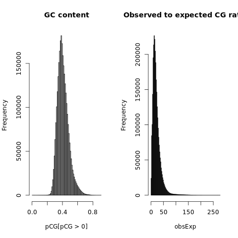
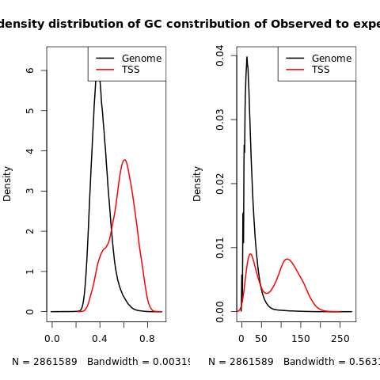

```{r, include = FALSE}
knitr::opts_chunk$set(echo = FALSE,  warning = FALSE,  message = FALSE)
```

It was known that in many mammalian genomes, including human, C and G bases are underrepresented and the occurrences of CG dinucleotide (where C and G are at consecutive bases) are depleted.  One explanation for the phenomena is DNA methylation. When C and G appear at consecutive bases, C tend to be methylated and the methylated C resembles T in its chemical structure so it’s very easily to be mutated to T. Over generations, the methylationmutation process accumulates, and CG’s in many unimportant positions are turned into TG’s.  

The rest of the CGs tends to cluster in small regions called “CpG islands” (CGIs), which are short interspersed DNA sequences that deviate significantly from the average genomic pattern by being GC-rich, CpG-rich, and predominantly nonmethylated. A genomic window is defined as a CGI if its GC content>50% and observed-to-expected CG ratio>0.6.

```{r}
load("../data/wholegenome.RData")
ratio=round(sum(CandG)/sum(CorG),2)
```

We use observed-to-expected CG ratio (OE ratio) to represent the occurrences of CG dinucleotide, which is computed at the  percentage of dinucleotides being CG divided by the product of percentage of bases being G and bases being C. The ratio is quite low in human genome, with the value of only `r ratio`. Table 1 shows the OE ratio of each chromosome. Figure 1 shows the distribution of GC content and OE ratio (in percentage) in whole genome, where the long tail of OE ratios are CpG islands.  

```{r}
library(knitr)
chroms<-c(paste0("chr",1:22),"chrX","chrY")
output1=data.frame(chromosome=chroms,ratio=cgratio)
kable(output1,caption="observed to expected CG ratio")
```



The transcription start site (TSS) is the location where transcription starts at the 5'-end of a gene sequence. The immediate vicinity of a TSS is active ground for the production of a number of RNAs other than those destined to become full-length, protein-coding mRNAs. After comparing the GC content and observed-to-expected CG ratio in whole genome and at gene TSS, we can conclude that the depletion of C, G and CG is less severe at gene promoter regions (Figure 2). The mean proportion of bases being G and bases being C in whole genome is significantly smaller than the mean proportion at gene TSS (0.378, 0.569, $p<0.001$). The mean observed-to-expected CG ratio in whole genome is also significantly smaller than that at gene TSS (22.21%, 83.57%, $p<0.001$).

  

```{r}
library(GenomicRanges)
load("../data/TSS.RData")
hg19_CGI <- read.delim("../data/hg19_CGI.txt")
CGI=GRanges(seqnames=Rle(hg19_CGI$chrom), ranges=IRanges(hg19_CGI$chromStart,hg19_CGI$chromEnd))
ratio=round(sum(TSS %over% CGI) / length(TSS) *100,2)
```

CGIs mark important regions in the genome. There are `r ratio`% of transcriptional starting sites overlap with CGI. It's known that about half of all CGIs self-evidently contain TSSs, as they coincide with promoters of annotated genes. The other half are either within or between characterized transcription units and have been termed “orphan” CGIs to reflect uncertainty over their significance.
